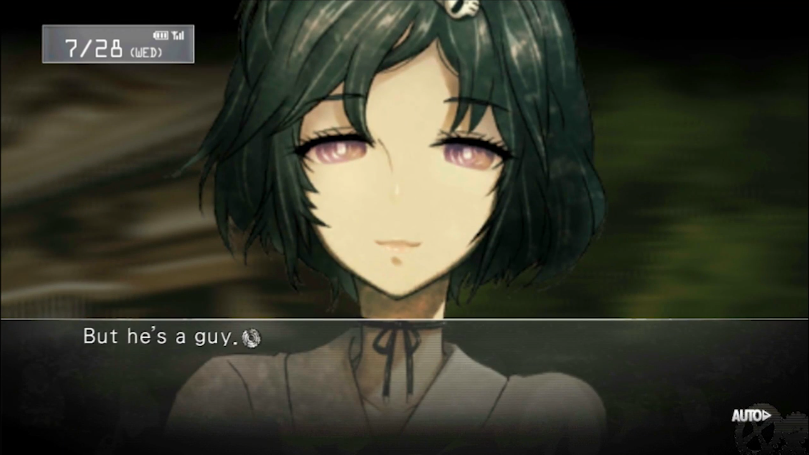
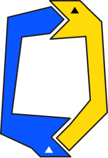
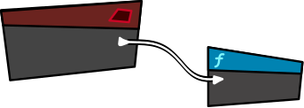
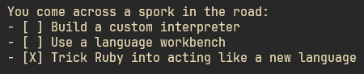

+++
author = "Novel Alex"
title = "an attempt at a visual novel engine"
date = "2025-11-20"
draft = false
description = "a story about making a story maker"
tags = [
    "gamedev", "programming"
]
+++

### Towards a Visual Novel

A visual novel is a type of game where the player reads a lot of text and interacts with the characters. 

I'm not doing a great job of explaining this, so let's consult <a href="https://en.wikipedia.org/wiki/Visual_novel">Wikipedia</a>.

<div>
  <blockquote cite="https://en.wikipedia.org/wiki/Visual_novel">
    <p>
      A visual novel (VN) is a form of digital interactive fiction.
      They combine a textual narrative with static or animated illustrations and a varying degree of interactivity.
    </p>
  </blockquote>
</div>

<figure>
  
  <figcaption>Steins;Gate (2009)</figcaption>
</figure>

So visual novels are games with loads of text. They also have visuals. 

They are supposed to have visuals<span id="ellipsis">...</span>

More on that later... 

My goal was to create a way for non-programmers to create visual novels by writing a simple script, with a syntax that can be read by anyone. 

### Domain Specific Languages

I wanted to build a [DSL (Domain Specific Language)](https://en.wikipedia.org/wiki/Domain-specific_language) to pull this off. 

A DSL is a special kind of language that is similar a general purpose programming language but it is made to do a very specific task. 

<div class="fc" ">
<div>
<p>For example, Python is a general purpose programming language. It can be used to build almost any type of software you could think of.</p>



</div>

<div>
<p>On the other hand, <a href="https://dev.epicgames.com/documentation/en-us/unreal-engine/blueprints-visual-scripting-in-unreal-engine">Unreal Blueprints</a> is a DSL. It was designed to build logic for video games running on Unreal Engine.</p>


</div>
</div>

<br>

I was considering my options, I could try to write a custom interpreter, or use a [language workbench](https://en.wikipedia.org/wiki/Language_workbench) like Jetbrains MPS as a platform to create my DSL, but I had another idea in mind.

At the time, I was messing around with a language called Ruby. 

The cool thing about Ruby is that it is flexible enough for me to define functions that feel like new syntax.



Ruby is a well known language that is used widely... for web development. Not a lot of folks are using Ruby as an embedded scripting language for games, because although Ruby is a wonderful language to work in, it's not the fastest.


But I was in a unique situation. Unlike most game engines that need their scripts to run at least once every 60th of a second. I only needed the script to be run once (kinda) at the beginning of the program.


I was ready to use Ruby and C++ to build the engine, before making a graphical application using SDL, I decided to get a text based prototype running in the terminal.

<aside style="font-size: 0.8rem;">

A side effect of using Ruby over languages like XML or JSON is that I can embed logic into my scripts.

This makes inventory systems, shops or friendship systems easy to implement.

</aside>


<div>

<p> The DSL is using a feature of Ruby called blocks. Blocks are pieces of code that can be given to a function as input, they can be stored for later use. Ruby's syntax for these functions mimics some features of the language and makes it seem as if these custom functions were part of the language. </p>


</div>

Using Ruby's blocks, the DSL allows you to write stories with a syntax that looks like this:

```ruby
create_story do
  character :wizard, "Wizzo the Wizard", :blue
  character :tarnished, "Tarnished", :green

  scene :start do
    description "You are at a crossroads in a forest."
    dialogue :tarnished, "Which path should I take?"
    choice "Take the left path", :left_path
    choice "Take the right path", :right_path
    choice "Take the cookie path", :cookie_path
  end
end
```


<div class="fc">
<div>

In the code above `create_story` is just a function that accepts a block as an argument. It just forwards that block into the constructor of the `Story` class. That's where the block gets run.
</div>

<div style="flex-grow: 2;">

  

</div>
</div>

The `Story` class holds on to the characters, the scenes, the current scene and the current state of the game.

```ruby
class Story
  attr_reader :scenes, :characters
  attr_accessor :state

  def initialize(&block)
    @scenes = {}
    @characters = {}
    @current_scene = nil
    instance_eval(&block) 
  end
  # ...

```

`instance_eval(&block)` is what runs the code of the block that was passed into the constructor.

The characters are represented by a map, which just keeps track of a user friendly version of their name and and the color to display their dialog in.

```ruby
 def character(name, display_name, color)
   @characters[name] = { name: display_name, color: color }
 end
```


A scene holds a timeline, which is just an array. The timeline contains each description or dialog that appears in order from top to bottom. 

The timeline for the `:start` scene would look like this:
```ruby
[
    "You are at a crossroad in a forest.",
     {
        character: :tarnished, 
        text: "Which path should I take?"
    }
]
```

This script by itself is just data, we need somthing that can understand it and turn it into an interactive story. 

We need an engine.

### The Engine

The engine is going to be responsible for turning the Ruby scripts into an actual game. 

Our engine only understand Ruby because of a library called [mruby](https://mruby.org/). mruby lets us include a small Ruby interpreter inside our C++ program. 

We can use this interpreter to call functions and pass objects between C++ and Ruby.

Before the engine can run a story, it needs to understand the DSL that we created. To do that we load our DSL script into the embedded ruby interpreter:

```cpp
std::string dsl_code = read_file("story_dsl.rb");
mrb_load_string(mrb, dsl_code.c_str());
```
This lets the interpreter know about our DSL, which is just a Class and a few simple functions.

Next, we can load a story script writting using the DSL:

```cpp
mrb_funcall(
  mrb, 
  mrb_top_self(mrb), 
  "load_story", 1, 
  mrb_str_new_cstr(mrb, "test_story.rb"));
```

The `load_story` function simply loads the file and runs it. The file just contains a call to `create_story` with a block representing the entire story:

```ruby
def load_story(filename)
  story_content = File.read(filename)
  $story = eval(story_content)
end

```

Now we have fully loaded a `Story` object into memory. It includes all the characters, scenes, choices and dialogs that are present in the script.  

The engine works through the story once scene at a time. The main loop looks like this:

```cpp
void StoryPlayer::play() {
    while (true) {
        mrb_value scene = mrb_utils.get_hash_value(scenes, current_scene.c_str());
        if (mrb_type(scene) == MRB_TT_FALSE) {
            std::cout << "[ERROR] :" << current_scene << " is not defined as a scene.\n";
        }

        print_timeline(scene);

        mrb_value choices = mrb_utils.get_hash_value(scene, "choices");
        mrb_value cont = mrb_utils.get_hash_value(scene, "continue");

        if (mrb_utils.hash_empty(choices) && mrb_utils.is_nil(cont)) {
            std::cout << "The End." << std::endl;
            break;
        }

        if (handle_continue(scene)) {
            flush_input_buffer();
            continue;
        }

        handle_choices(scene);
    }
}
```
This loop does three main things:

1. It prints the current scene's timeline, which includes all the descriptions and dialogs in the scene.
2. It handles moving to the next scene, until there are no scenes to move forward to.
3. It prints the choices the scene contains and asks the player to pick one and handles it accordingly.


Because the DSL stores everything in plain Ruby maps and arrays, the engine's job is to look up values in the maps, interpret and display them and move through the scenes based on player input:

```cpp
mrb_value choices = mrb_utils.get_hash_value(scene, "choices");
// ....
int choice;
do {
    std::cout << "Choose (1-" << choices_len << "): ";
    std::cin >> choice;
} while (choice < 1 || choice > choices_len);

mrb_value chosen_key = mrb_utils.array_entry(choice_keys, choice - 1);
mrb_value choice_map = mrb_utils.get_hash_value(choices, chosen_key);
// ...
current_scene = mrb_utils.symbol_name(mrb_utils.get_hash_value(choice_map, "next_scene"));

```
<!-- The DSL is used to describe the game, and the engine turns that description into gameplay. -->

Once all that is in place, running the program looks like this:


### The Cliffhanger

I've set out to create a visual novel, but as of now I have a data-driven text adventure engine.

Stay tuned for Graphics.

<script>
  const ellipsis = document.getElementById('ellipsis');
  const dots = [".", "..", "..."];
  let index = 0;

  setInterval(() => {
    index = (index + 1) % dots.length; // cycle 0 → 1 → 2 → 0
    ellipsis.textContent = dots[index];
  }, 1000); // changes every 0.5 seconds
</script>