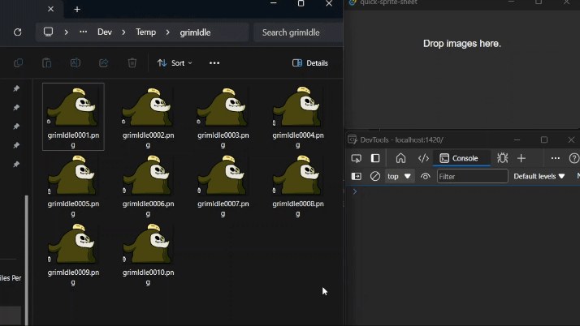

+++
author = "Novel Alex"
title = "making spritesheets quickly"
date = "2024-05-24"
draft = false
description = "because i'm too lazy to open up aseprite"
tags = [
    "gamedev", "programming", "art"
]
+++

Me and my friend started working on a game recently, where he is working on the art, and I am doing the programming. Our 
general workflow for putting an animation into Godot looks like this: He exports an image sequence from Animate and sends
it to me, I then import those images into Aseprite as an animation then I export this animation as a sprite sheet and then
finally import in into Godot.


---

Animation By Pictoco

I want to be able to automate the whole Aseprite step, I want a program I can drag an image sequence into and have it
spit out a sprite sheet. 

I've had the [Tauri](https://tauri.app/) framework on my radar for a while now, and now I have a reason to play around
with it. It lets me write the frontend of the app in html/css/js and the backend in Rust. 

I can register a file drop event and print out what happens when some files are dragged in.
```typescript
// main.ts
import { listen } from '@tauri-apps/api/event'

listen('tauri://file-drop', event => {
    console.log(event)
})
```
When I drag a file into the window, I can access the paths:


I'll need a way to send these paths to my rust code, I can do that by creating a Tauri command
```rust
// main.rs
#[tauri::command(rename_all = "snake_case")]
fn sprite_dropped(payload: &str){
    // do stuff
}
```

`sprite_dropped` can now be called from the typescript with the `invoke` function. The payload argument is passed in as a JSON object.

```typescript
import {invoke} from "@tauri-apps/api/tauri";

invoke('sprite_dropped', {payload: JSON.stringify(event.payload)})
```

Back in our Rust code we can use `serde_json` to deserialize our JSON string into a vector of strings.
```rust
serde_json::from_str(payload).expect("Error parsing JSON");
```

Then we can use the [`image`](https://crates.io/crates/image) crate to load all the images into a vector.

```rust
let mut imgs: Vec<DynamicImage> = Vec::new();
for file in file_names {
    imgs.push(image::open(file).unwrap())
}
```

We can create an `ImageBuffer` to hold the data for our output image, its height will be the same as the height of a single
frame, and its width can be calculated by multiplying the width of a single frame by the amount of frames.

```rust
let mut out_buffer = image::ImageBuffer::new(
        imgs[0].width() * imgs.len() as u32,
        imgs[0].height());
```

And then clear the buffer with transparent pixels.

```rust
for (_, _, pixel) in out_buffer.enumerate_pixels_mut() {
    *pixel = image::Rgba([0, 0, 0, 0]);
}
```

Now I just want to place the input images into the buffer side by side in a single strip.

```rust
for (i, img) in imgs.into_iter().enumerate() {
    image::imageops::overlay(
        &mut out_buffer,
        &img, 
        (in_img_width * i as u32) as i64, 
        0);
}
```

Here's the code I put together to clean up the file name. It is supposed to remove numbers from the end of the file
name, and I am about 80 percent sure that it does exactly what I want it to do.

```rust 
let out_name = {
    let file_name = file_names[0].clone();
    let file_name = file_name.as_str();
    let file_name = file_name
        .rsplit('.').collect::<Vec<_>>()[1];
    let file_name = file_name
        .trim_end_matches(|c: char| c.is_ascii_digit());
    let file_name = format!("{}.png", file_name);
    file_name
};
```

Now I just have to save it.

```rust
out_buffer.save(out_name).unwrap();
```

And I can now very quickly make sprite sheets.



Here's the [GitHub](https://github.com/novelalex/quick-sprite-sheet) page.