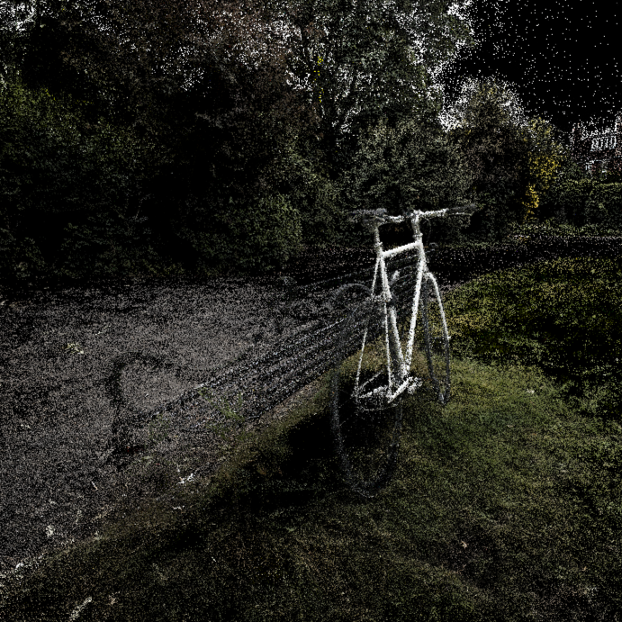
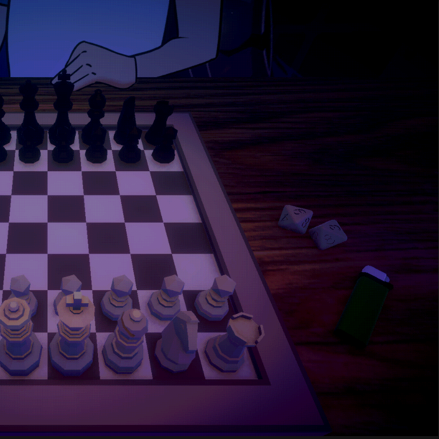
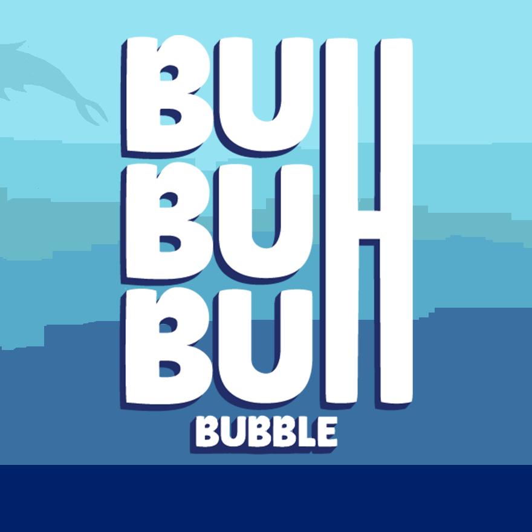

#### I’m currently building

  

  

    <b>Rent Dungeon</b>
    
A first person dungeon crawler

  

  

  

    <b>Gaussian Splatting Exploration</b>
    
Learning more about gaussian splatting by building a renderer based on the <a href="https://repo-sam.inria.fr/fungraph/3d-gaussian-splatting/3d_gaussian_splatting_low.pdf">paper</a>

  

 

#### I have worked on

  
  

    <b><a href="https://zoeeechu.itch.io/pyro-check">Pyro Check</a></b>
    
Chess with a twist.   <a style="font-size: 0.8rem;" href="https://torontogamesweek.com/schedule/2024.html#day7">[Showcased at Toronto Games Week 2024]</a>

  

  
  

    <b><a href="https://zoeeechu.itch.io/buhbuhbuhbubbles">Buh Buh Buh Bubbles</a></b>
    
Navigate a bubble out of the perilous depths

    
Role: Musican

  

  
  

    <b>LightLock</b>
    
Co-op puzzle platformer where everybody is chained together.   <a style="font-size: 0.8rem;" href="https://levelupshowcase.com/archive/">[Showcased at Level Up 2025]</a>

  

 

